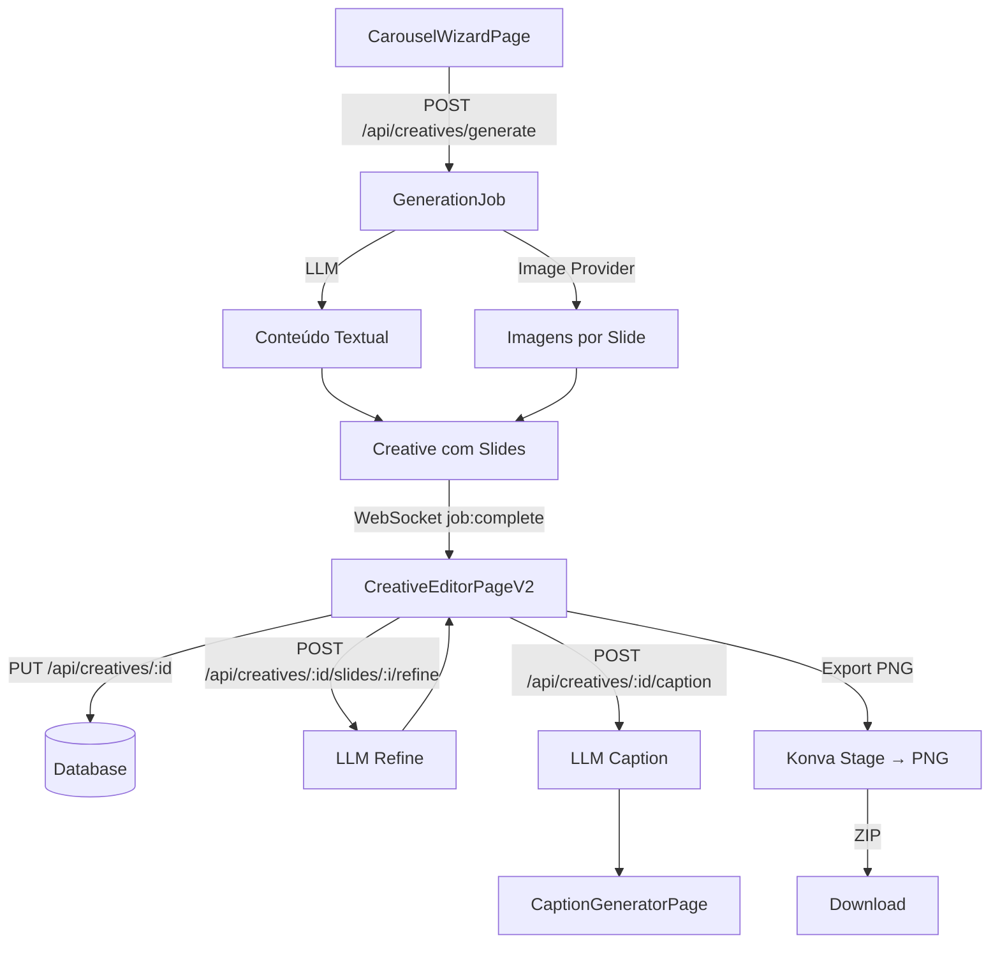

# SDD — BriefFlow Creatives: Editor Visual de Carrosséis

| Campo          | Valor                                                       |
| -------------- | ----------------------------------------------------------- |
| Tech Lead      | Gabriel                                                     |
| Produto        | BriefFlow Content-Generator                                 |
| Módulo         | Creatives — Editor Visual de Carrosséis                     |
| Épico          | `wip/modelo-util-atual`                                     |
| Status         | In Progress                                                 |
| Criado em      | 2026-04-24                                                  |
| Última revisão | 2026-04-24                                                  |
| Referência     | MyPostFlow (transcrição de vídeo + capturas de tela)        |

---

## Contexto

O BriefFlow já possui uma rota `/creatives` com infraestrutura básica: CRUD de criativos via API, templates em banco (`creative_templates`), editor de canvas com Konva, exportação PNG/ZIP e resolução de placeholders. No entanto, a experiência atual está longe do nível do produto de referência **MyPostFlow**, que é uma ferramenta SaaS completa de geração e edição visual de carrosséis para Instagram com IA.

O objetivo deste documento é especificar o que precisa ser construído e/ou evoluído na rota CREATIVES do BriefFlow para que atinja paridade funcional e visual com o MyPostFlow, com base em:
- Análise completa do código existente
- Transcrição integral do vídeo de demonstração do MyPostFlow
- Capturas de tela da interface de referência

**Domínio**: Geração e edição de conteúdo visual para redes sociais, focado em carrosséis para Instagram.

**Usuários-alvo**: Criadores de conteúdo, social media managers, empresas pequenas que precisam escalar produção de posts.

---

## Definição do Problema

### Problemas atuais

- **Editor incompleto**: O `CreativeEditor.tsx` renderiza slides com Konva mas não expõe controles avançados de estilo (overlay, shadow, posicionamento de texto em 9 zonas, tipografia por slide, etc.).
- **Sem geração de imagens por IA**: O sistema atual não gera imagens; apenas aceita imagens já existentes. O MyPostFlow gera imagens automaticamente contextualizadas ao conteúdo de cada slide.
- **Sem refinamento por slide**: Não existe funcionalidade de "refinar slide com IA" ou "gerar conteúdo deste slide com IA" individualmente.
- **Sem gerador de legendas**: Não há funcionalidade separada para gerar caption + hashtags a partir do carrossel.
- **Sem modo Profile**: Só existe o modo Minimalista. O modo Profile (layout estilo Twitter com thumbnails) não está implementado.
- **Sem configurações de fontes e tipografia avançada**: Não há seletor de combinação de fontes, escala global, ou control granular de tamanho por elemento.
- **Export por slide não existe**: O download é apenas para todo o ZIP. Não há "Baixar Slide X" individualmente.
- **Sem aplicação de configurações ao próximo slide**: Não há botão para propagar formatação do slide atual para o próximo.

### Por que agora?

A rota `/creatives` já tem infraestrutura de dados (banco, rotas API, hooks React) funcionando. Este é o momento ideal para construir a camada de UI/UX sobre essa fundação, antes que o produto seja lançado para usuários reais.

### Impacto de não resolver

- Produto inutilizável para o usuário final: sem as ferramentas de edição básicas, ninguém consegue criar um carrossel completo e bonito
- Diferencial competitivo perdido: o MyPostFlow já está no mercado e gerando receita; permanecer com o editor básico atrasa o go-to-market

---

## Escopo

### ✅ V1 — Em escopo (MVP completo)

**Fluxo de criação:**
- Gerador de carrossel com IA: prompt de texto + número de slides (1-10)
- Upload de imagem de referência (drag-and-drop e colar do clipboard)
- Seleção de modo de imagem: apenas fundo, apenas grade, ou ambos
- Geração de imagens por IA para cada slide (integração com provider de imagem)
- Direcionamento de estilo de imagem (campo opcional de texto)
- Campo de Instagram handle
- Seleção de combinação de fontes (9 opções)
- Seleção de cor de destaque (accent color)
- Dois modos de layout: **Minimalista** e **Profile**

**Editor (modo Minimalista):**
- Painel esquerdo com seções colapsáveis:
  - Imagem de Fundo: upload, posição X/Y, zoom, geração com IA
  - Sombra/Overlay: estilo (base, base forte, topo forte, diagonal inf.dir, diagonal sup.esq), opacidade
  - Fundo do Slide: cor de fundo
  - Grade de Imagens: toggle mostrar/ocultar grade
  - Título & Subtítulo: textarea editável, geração por IA, refinamento por IA
  - Posicionamento de texto: grid 3×3 (9 posições), alinhamento L/C/R
  - Tipografia: escala global, tamanho título, família de fonte, tamanho subtítulo
  - Destaque de palavras: cor accent aplicável a palavras específicas
  - Badge de perfil: toggle, foto, estilo (sólido, minimal, glass)
  - Botões CTA: toggle, tamanho, arredondamento, estilo
- Navegação entre slides (top bar: "Slide X de Y", prev/next, adicionar, excluir)
- Tema por slide: Escuro / Claro
- Aplicar configurações ao próximo slide
- Download do slide atual ("Baixar Slide X")
- Download de todos os slides (ZIP)

**Editor (modo Profile):**
- Foto de perfil + nome + handle
- Estilo do badge: sólido, minimal, glass
- Número de thumbnails por slide: 1, 2, ou alternado
- Arredondamento das imagens
- Mesmas opções de tipografia e conteúdo do Minimalista

**Gerador de Legenda:**
- Aba/botão "Gerar Legenda" separado do editor
- Gera caption com texto e hashtags a partir do conteúdo dos slides
- Botão de copiar legenda

### ❌ Fora de escopo (V1)

- Publicação direta no Instagram (via API Graph)
- Agendamento de posts
- Analytics de performance dos carrosséis
- Multi-plataforma (LinkedIn, Facebook) — foco total em Instagram
- Geração de múltiplos carrosséis simultaneamente
- Stories (formato vertical 9:16)
- Editor de vídeo ou Reels
- Templates de storytelling (mencionado no vídeo como "futuro")
- Marketplace de templates

### 🔮 V2+ (pós-lançamento)

- Publicação direta via API Graph do Instagram
- Agendamento de posts com calendário editorial
- Templates de Storytelling
- Geração de múltiplos carrosséis em lote
- Stories (1080×1920)
- Analytics: visualizações, saves, alcance

---

## Solução Técnica

### Visão Geral da Arquitetura

```
┌─────────────────────────────────────────────────────────────────┐
│                    FLUXO COMPLETO V1                             │
└─────────────────────────────────────────────────────────────────┘

[1] CarouselWizardPage (novo)
    ├─ Seleção de modo: Minimalista | Profile
    ├─ Prompt de conteúdo
    ├─ Upload de imagem referência
    ├─ Configuração: n° slides, modo de imagem, estilo IA
    ├─ Instagram handle, combinação de fontes, accent color
    └─ POST /api/creatives/generate
              ↓ job_id
    ├─ WebSocket: monitora geração
    └─ Redireciona para editor ao concluir

[2] CreativeEditorPageV2 (substituição/evolução)
    ├─ SlideNavigationBar (topo)
    ├─ EditorLeftPanel (painel lateral esquerdo)
    │   ├─ BackgroundImageSection
    │   ├─ ShadowOverlaySection
    │   ├─ SlideBackgroundSection
    │   ├─ ImageGridSection
    │   ├─ TitleSubtitleSection
    │   ├─ LayoutPositionSection
    │   ├─ TypographySection
    │   ├─ AccentColorSection
    │   ├─ ProfileBadgeSection (modo Minimalista)
    │   ├─ ProfileConfigSection (modo Profile)
    │   └─ CTAButtonSection
    ├─ SlidePreviewCanvas (centro — Konva)
    └─ DownloadBar (fundo)
        ├─ "Baixar Slide X"
        ├─ "ZIP (N)"
        └─ "Atualizar" (salvar)

[3] CaptionGeneratorPage (nova aba/rota)
    ├─ Exibe resumo dos slides
    ├─ POST /api/creatives/:id/caption
    └─ Caption + hashtags + botão copiar

[4] Backend: Geração e IA
    ├─ POST /api/creatives/generate
    │   ├─ Gera conteúdo de texto (LLM)
    │   ├─ Gera imagens por slide (image provider)
    │   └─ Cria Creative com slides preenchidas
    ├─ POST /api/creatives/:id/slides/:slideIndex/generate-content
    │   └─ Regenera texto de um slide específico
    ├─ POST /api/creatives/:id/slides/:slideIndex/refine
    │   ├─ Recebe instrução de refinamento
    │   └─ Retorna slide atualizado
    └─ POST /api/creatives/:id/caption
        └─ Gera legenda + hashtags
```

### Diagrama de Fluxo de Dados



### Estrutura de Dados — Evolução do Slide

O tipo `Slide` existente precisa ser estendido para suportar todos os controles do editor:

```typescript
// creative-editor-types.ts — versão evoluída
interface Slide {
  id: string;
  index: number;
  theme: 'dark' | 'light';                  // NOVO: tema por slide
  background: SlideBackground;
  overlay: SlideOverlay;                     // NOVO: sombra/overlay
  imageGrid: SlideImageGrid;                 // NOVO: grade de imagens
  textLayout: SlideTextLayout;               // NOVO: posição e alinhamento
  typography: SlideTypography;               // NOVO: tipografia completa
  profileBadge?: SlideProfileBadge;          // NOVO: badge de perfil
  ctaButton?: SlideCtaButton;                // NOVO: botão CTA
  layers: Layer[];
}

interface SlideBackground {
  type: 'color' | 'gradient' | 'image';
  color?: string;
  gradient?: { from: string; to: string; angle: number };
  imageUrl?: string;
  imagePositionX: number;     // 0-100
  imagePositionY: number;     // 0-100
  imageZoom: number;          // 100-300
}

interface SlideOverlay {
  style: 'none' | 'base' | 'base-forte' | 'topo-forte' | 'diag-inf-dir' | 'diag-sup-esq';
  opacity: number;            // 0-100
  color: string;              // hex
}

interface SlideImageGrid {
  visible: boolean;
  imageUrl?: string;
  borderRadius: number;       // 0-50
}

interface SlideTextLayout {
  position: TextPosition;     // 'top-left' | 'top-center' | 'top-right' | 'mid-left' | 'mid' | 'mid-right' | 'bot-left' | 'bot-center' | 'bot-right'
  alignment: 'left' | 'center' | 'right';
  title: string;
  subtitle: string;
}

interface SlideTypography {
  globalScale: number;        // 50-200 (percentual)
  titleFontSize: number;      // px base
  titleFontFamily: FontFamily;
  subtitleFontSize: number;   // px base
  accentColor: string;        // hex — cor de palavras em destaque
  accentWords: string[];      // palavras que recebem accent color
}

type FontFamily = 'Inter' | 'Space' | 'Syne' | 'Outfit' | 'DM Sans' | 'Raleway' | 'Oswald' | 'Playfair' | 'Caveat';

interface SlideProfileBadge {
  visible: boolean;
  imageUrl?: string;
  name: string;
  handle: string;
  style: 'solid' | 'minimal' | 'glass';
  size: number;               // 40-120
  position: TextPosition;
}

interface SlideCtaButton {
  visible: boolean;
  text: string;
  style: 'filled' | 'outline' | 'glass';
  size: number;               // 14-24 (font size)
  borderRadius: number;       // 0-50
  backgroundColor: string;
  textColor: string;
}
```

### Estrutura de Dados — Creative (evolução)

```typescript
interface Creative {
  id: string;
  tenantId: string;
  clientId: string;
  postId: string | null;
  templateId: string | null;
  type: 'carousel' | 'single' | 'story' | 'ad';
  platform: string;
  layoutMode: 'minimalist' | 'profile';     // NOVO
  slides: Slide[];
  profileConfig?: ProfileConfig;             // NOVO: configurações do modo Profile
  fontCombination: FontCombination;          // NOVO
  accentColor: string;                       // NOVO: cor accent global
  instagramHandle: string;                   // NOVO
  exportUrls: string[];
  status: 'draft' | 'ready' | 'published';
  createdAt: string;
  updatedAt: string;
}

interface ProfileConfig {
  photoUrl?: string;
  name: string;
  handle: string;
  badgeStyle: 'solid' | 'minimal' | 'glass';
  thumbnailCount: 1 | 2 | 'alternating';
  borderRadius: number;
}

type FontCombination =
  | { title: 'Space'; body: 'Inter' }
  | { title: 'Syne'; body: 'Outfit' }
  | { title: 'DM Sans'; body: 'Raleway' }
  | { title: 'Oswald'; body: 'Inter' }
  | { title: 'Playfair'; body: 'DM Sans' }
  | { title: 'Caveat'; body: 'Inter' };
```

---

## APIs & Endpoints

### Novos Endpoints

| Endpoint | Método | Descrição | Request | Response |
|---|---|---|---|---|
| `/api/creatives/generate` | POST | Gera carrossel completo com IA | `GenerateCarouselDto` | `{ job_id }` |
| `/api/creatives/:id/slides/:idx/generate-content` | POST | Regenera texto de um slide | `{ instruction? }` | `Slide` atualizado |
| `/api/creatives/:id/slides/:idx/refine` | POST | Refina slide com instrução | `{ instruction: string }` | `Slide` atualizado |
| `/api/creatives/:id/caption` | POST | Gera legenda + hashtags | `{ tone?: string }` | `{ caption, hashtags }` |
| `/api/creatives/:id/slides/:idx/generate-image` | POST | Regenera imagem de um slide | `{ styleHint?: string }` | `{ imageUrl }` |

### Contratos de Request/Response

```json
// POST /api/creatives/generate
{
  "clientId": "uuid",
  "prompt": "Crie um carrossel sobre os 5 benefícios do marketing digital",
  "referenceImageUrl": "data:image/...base64...",  // opcional
  "slidesCount": 6,
  "imageMode": "grid",             // "background" | "grid" | "both"
  "imageStyleHint": "pessoas realistas, foco no rosto",  // opcional
  "layoutMode": "minimalist",      // "minimalist" | "profile"
  "instagramHandle": "@emp.wesleysilva",
  "fontCombination": { "title": "Space", "body": "Inter" },
  "accentColor": "#3B82F6",
  "generateImages": true
}

// Response 202 Accepted
{
  "job_id": "job-uuid",
  "message": "Geração iniciada"
}

// WebSocket evento ao concluir
{
  "type": "job:complete",
  "jobId": "job-uuid",
  "creativeId": "creative-uuid"
}
```

```json
// POST /api/creatives/:id/slides/:idx/refine
{
  "instruction": "deixe mais agressivo, encurte o subtítulo, adicione dado estatístico"
}

// Response 200 OK
{
  "index": 2,
  "textLayout": {
    "title": "87% das empresas já usam IA",
    "subtitle": "E você ainda está ficando para trás."
  }
}
```

```json
// POST /api/creatives/:id/caption
{
  "tone": "engajamento"
}

// Response 200 OK
{
  "caption": "Seu concorrente já está usando IA para criar conteúdo enquanto você ainda faz isso manualmente...\n\nA matemática é simples: quem usa IA publica 10x mais.\n\nSalva esse post para lembrar depois! 👇",
  "hashtags": ["#marketingdigital", "#inteligenciaartificial", "#crescernoinstragram", "#contentmarketing", "#socialmedia"]
}
```

### Endpoints Existentes — Modificações

| Endpoint | Mudança |
|---|---|
| `POST /api/creatives` | Adicionar campos: `layoutMode`, `fontCombination`, `accentColor`, `instagramHandle`, `profileConfig` |
| `PUT /api/creatives/:id` | Aceitar mesmos novos campos + slides com estrutura evoluída |

---

## Mudanças no Banco de Dados

### Tabela `creatives` — Novos campos

```sql
-- Migration: 013_creatives_v2.sql
ALTER TABLE creatives
  ADD COLUMN layout_mode TEXT NOT NULL DEFAULT 'minimalist'
    CHECK (layout_mode IN ('minimalist', 'profile')),
  ADD COLUMN font_combination JSONB DEFAULT '{"title":"Space","body":"Inter"}',
  ADD COLUMN accent_color TEXT DEFAULT '#3B82F6',
  ADD COLUMN instagram_handle TEXT DEFAULT '',
  ADD COLUMN profile_config JSONB DEFAULT NULL;

-- Índice para consultas por layout_mode
CREATE INDEX idx_creatives_layout_mode ON creatives(layout_mode);
```

### Tabela `creative_generation_jobs` — Nova

```sql
-- Separa jobs de geração de carrossel dos jobs de post
CREATE TABLE creative_generation_jobs (
  id UUID PRIMARY KEY DEFAULT gen_random_uuid(),
  tenant_id UUID NOT NULL REFERENCES tenants(id) ON DELETE CASCADE,
  client_id UUID NOT NULL REFERENCES clients(id) ON DELETE CASCADE,
  creative_id UUID REFERENCES creatives(id) ON DELETE SET NULL,
  status TEXT NOT NULL DEFAULT 'queued'
    CHECK (status IN ('queued', 'processing', 'completed', 'failed')),
  stage TEXT,
  progress INTEGER DEFAULT 0 CHECK (progress BETWEEN 0 AND 100),
  payload JSONB NOT NULL,        -- request completo do GenerateCarouselDto
  error TEXT,
  created_at TIMESTAMPTZ DEFAULT NOW(),
  updated_at TIMESTAMPTZ DEFAULT NOW()
);

CREATE INDEX idx_creative_jobs_tenant ON creative_generation_jobs(tenant_id);
CREATE INDEX idx_creative_jobs_status ON creative_generation_jobs(status)
  WHERE status IN ('queued', 'processing');
```

### Storage de Exports (decisão)

**Abordagem escolhida: base64 data URIs diretamente no campo `export_urls` (JSONB no PostgreSQL).**

Motivo: evita dependência de serviço de objeto externo (Supabase Storage, S3) e simplifica o stack — o banco já está disponível.

Implicação: cada PNG 1080×1080 pesa ~150-400 KB como base64. Para 6 slides isso é ~1-2 MB por criativo. Aceitável para o volume inicial; caso o DB cresça significativamente, migrar para Supabase Storage troca apenas a chamada de upload sem mudar a interface da API.

```sql
-- export_urls armazena data URIs:
-- ["data:image/png;base64,iVBOR...", "data:image/png;base64,..."]
```

### Estratégia de Migração

1. A migração `013_creatives_v2.sql` adiciona colunas com `DEFAULT`, sem downtime
2. O campo `slides` (JSONB) já existe; os novos campos de cada slide são adicionados progressivamente com defaults no código
3. Criativos antigos continuam funcionando com os defaults (`layout_mode = 'minimalist'`, sem overlay, sem badge)

---

## Especificações de UI/UX

### Hierarquia de Páginas

```
/creatives                         → Lista de criativos (já existe)
/creatives/new                     → CarouselWizardPage (NOVO)
/creatives/:id/edit                → CreativeEditorPageV2 (EVOLUÇÃO)
/creatives/:id/caption             → CaptionGeneratorPage (NOVO)
```

### CarouselWizardPage — Layout

```
┌──────────────────────────────────────────────────┐
│  MINIMALISTA    |    PROFILE                      │
│  [btn selected] |    [btn]                        │
├──────────────────────────────────────────────────┤
│  FUNDO DO SLIDE                                  │
│  [● Escuro]  [○ Claro]                           │
├──────────────────────────────────────────────────┤
│  ✨ Gerar com IA                             [>]  │
│  ─────────────────────────────────────────────── │
│  Prompt:                                         │
│  [textarea: "Descreva o conteúdo do carrossel"]  │
│                                                  │
│  Imagem de referência:                           │
│  [  📷 Clique ou arraste  ] [📋 Colar clipboard] │
│                                                  │
│  Número de slides: [──○────] 6                   │
│                                                  │
│  Modo de imagem no carrossel:                    │
│  [○] Só imagem de fundo                          │
│  [●] Grade de imagens                            │
│  [○] Ambas                                       │
│                                                  │
│  [✓] Gerar imagens com IA (Nano Banana)          │
│      Direcionamento: [campo opcional texto]      │
│                                                  │
│  Instagram: [@seu.perfil]                        │
│                                                  │
│  Combinação de fontes:                           │
│  [Inter] [Space ●] [Syne] [Outfit]               │
│  [DM Sans] [Raleway] [Oswald] [Playfair] [Caveat]│
│                                                  │
│  Cor destaque: [  ■  ] (color picker)            │
│                                                  │
│  [       Gerar Carrossel →       ]               │
└──────────────────────────────────────────────────┘
```

### CreativeEditorPageV2 — Layout Geral

```
┌────────────────────────────────────────────────────────────────────────┐
│ [MINIMALISTA] [PROFILE]  ← Slide 3 de 6 → [+] [🗑]    Gerar Legenda  │
├──────────────┬─────────────────────────────────────────────────────────┤
│              │                                                          │
│  LEFT PANEL  │                 PREVIEW CANVAS                          │
│  (260px)     │                   (Konva Stage)                         │
│  colapsável  │                 1080×1080 escalado                      │
│              │                                                          │
│  [seções     │                                                          │
│   abaixo]    │                                                          │
│              │                                                          │
├──────────────┴─────────────────────────────────────────────────────────┤
│  ⬆ Atualizar                    ⬇ Baixar Slide 3        📦 ZIP (6)    │
└────────────────────────────────────────────────────────────────────────┘
```

### Left Panel — Seções (modo Minimalista)

**Imagem de Fundo:**
```
├─ FOTO: [📷 Clique ou arraste] [📋 Colar clipboard]
├─ [✨ Gerar imagem com IA (Nano Banana)]
├─ POSIÇÃO X: [slider 0-100] valor
├─ POSIÇÃO Y: [slider 0-100] valor
└─ ZOOM %: [slider 100-300] valor
```

**Sombra / Overlay:**
```
├─ ESTILO: [dropdown: Nenhum | Base | Base Forte | Topo Forte | Diag. inf.dir | Diag. sup.esq]
└─ OPACIDADE: [slider 0-100] valor
```

**Fundo do Slide:**
```
└─ COR DE FUNDO: [color picker]
```

**Grade de Imagens:**
```
└─ Mostrar grade: [checkbox]
```

**Título & Subtítulo:**
```
├─ LAYOUT & POSIÇÃO: [grid 3×3 botões com ícone de texto]
│    SUP.ESQ  SUP.CENTRO  SUP.DIR
│    MEIO.ESQ  MEIO  MEIO.DIR
│    INF.ESQ  INF.CENTRO(●)  INF.DIR
├─ ALINHAMENTO: [ESQ] [CENTRO(●)] [DIR]
├─ TÍTULO: [textarea]
├─ SUBTÍTULO: [textarea]
├─ [✨ Gerar conteúdo deste slide com IA]
│    (Adapta ao contexto dos outros slides)
├─ ─ REFINAR SLIDE COM IA ─
├─ [textarea: Ex: "deixe mais agressivo"...]
└─ [✨ Refinar este slide]
```

**Tipografia:**
```
├─ ESCALA GLOBAL — 100%: [slider 50-200] valor
│    Zoom no bloco inteiro (sem mudar quebras de linha)
├─ TÍTULO — 107PX: [slider 24-200] valor
│    Base (multiplicada pela escala)
├─ FONTE DO TÍTULO:
│    [Inter] [Space(●)] [Syne] [Outfit]
│    [DM Sans] [Raleway] [Oswald] [Playfair] [Caveat]
└─ SUBTÍTULO — 28PX: [slider 12-72] valor
```

**Badge de Perfil:**
```
├─ Exibir badge de perfil: [checkbox]
├─ (se ativo:)
│    Foto: [upload]
│    Nome: [input]
│    @: [input]
├─ ESTILO: [Sólido] [Minimal] [Glass]
└─ TAMANHO: [slider]
```

**Botões CTA:**
```
├─ Exibir botão CTA: [checkbox]
├─ (se ativo:)
│    Texto: [input]
├─ ESTILO: [Preenchido] [Contorno] [Glass]
├─ TAMANHO: [slider]
└─ ARREDONDAMENTO: [slider]
```

**Ações de slide:**
```
└─ [→ Aplicar configurações no próximo slide]
```

### CaptionGeneratorPage — Layout

```
┌─────────────────────────────────────────────────┐
│  ← Voltar ao editor                             │
│                                                 │
│  Gerar Legenda para @emp.wesleysilva            │
│                                                 │
│  Resumo do carrossel:                           │
│  [preview miniaturas dos slides]                │
│                                                 │
│  [      ✨ Gerar Legenda      ]                 │
│                                                 │
│  ─────────────────────────────────────────────  │
│                                                 │
│  Legenda:                                       │
│  [textarea com caption gerada]                  │
│                                                 │
│  Hashtags:                                      │
│  #marketingdigital #inteligenciaartificial ...  │
│                                                 │
│  [     📋 Copiar tudo     ]                     │
└─────────────────────────────────────────────────┘
```

---

## Componentes Novos/Evoluídos

### Novos Componentes (client/src/components/creative-editor/)

| Componente | Responsabilidade |
|---|---|
| `CarouselWizard.tsx` | Formulário wizard de criação |
| `WizardPromptStep.tsx` | Etapa de prompt e configurações |
| `WizardFontStep.tsx` | Seleção de fontes e cor accent |
| `EditorLeftPanelV2.tsx` | Painel lateral completo (orquestra seções) |
| `BackgroundImageSection.tsx` | Upload + sliders de posição/zoom |
| `ShadowOverlaySection.tsx` | Dropdown de estilo + slider de opacidade |
| `SlideBackgroundSection.tsx` | Color picker de fundo |
| `ImageGridSection.tsx` | Toggle de grade |
| `TitleSubtitleSection.tsx` | Textareas + botões de IA |
| `LayoutPositionSection.tsx` | Grid 3×3 + alinhamento |
| `TypographySection.tsx` | Escala global + tamanhos + família |
| `ProfileBadgeSection.tsx` | Badge de perfil (modo Minimalist) |
| `ProfileConfigSection.tsx` | Configuração completa (modo Profile) |
| `CTAButtonSection.tsx` | Controles do botão CTA |
| `SlideNavigationBar.tsx` | Barra topo: "Slide X de Y" + prev/next/add/del |
| `DownloadBar.tsx` | Barra fundo: baixar slide + ZIP + salvar |
| `CaptionGenerator.tsx` | Gerador de legenda e hashtags |
| `FontFamilyPicker.tsx` | Grid de botões de fonte com preview |
| `SlideThemeToggle.tsx` | Toggle Escuro/Claro por slide |

### Componentes Evoluídos

| Componente | Mudança |
|---|---|
| `SlideCanvas.tsx` | Renderizar overlay, grade, badge, CTA, posicionamento 9 zonas |
| `CreativeEditor.tsx` → `CreativeEditorPageV2.tsx` | Orquestrar novo painel + nova nav bar |
| `SlideThumbnailPanel.tsx` | Integrar ao `SlideNavigationBar` |

### Novos Hooks (client/src/hooks/)

| Hook | Responsabilidade |
|---|---|
| `use-creative-generation.ts` | Lógica do wizard de criação + polling job |
| `use-slide-ai.ts` | Gerar/refinar conteúdo de slide individual |
| `use-caption-generator.ts` | POST para gerar legenda |
| `use-slide-image.ts` | Upload e geração de imagem por slide |

---

## Integração com Provedores de IA

### Geração de Texto (slides)

Usa o `llm-provider.ts` existente. Novos prompts:

**Prompt: Gerar carrossel completo**
```
Você é um especialista em criação de conteúdo viral para Instagram.
Crie um carrossel com {N} slides sobre: "{prompt}"
Cliente: {clientName} | Handle: {instagramHandle}
Tom: envolvente, direto, com punch

Para cada slide retorne JSON:
{ "slides": [
  { "index": 1, "title": "...", "subtitle": "..." },
  ...
  { "index": N, "title": "CTA aqui", "subtitle": "instrução de ação" }
]}
```

**Prompt: Refinar slide**
```
Carrossel sobre: "{topic}"
Slide atual:
  Título: "{title}"
  Subtítulo: "{subtitle}"
  
Instrução de refinamento: "{instruction}"

Retorne o slide refinado em JSON:
{ "title": "...", "subtitle": "..." }
```

**Prompt: Gerar legenda**
```
Carrossel para Instagram com slides:
{slidesContent}

Crie uma legenda engajante com:
1. Gancho de abertura forte
2. Desenvolvimento do tema (2-3 linhas)
3. CTA claro (salva, comenta, etc.)
4. 5-8 hashtags relevantes

Retorne JSON: { "caption": "...", "hashtags": ["..."] }
```

### Geração de Imagens

**Provider:** [fal.ai](https://fal.ai) com modelo **Flux** (via API REST).

**Variável de ambiente:** `FAL_API_KEY` (nunca hardcoded; adicionar ao `.env` e às variáveis do servidor).

**Modelo recomendado:** `fal-ai/flux/schnell` (rápido, custo menor) ou `fal-ai/flux-pro` (maior qualidade).

**Interface proposta:**
```typescript
// server/services/image-generation-provider.ts
interface ImageGenerationProvider {
  generateImage(options: ImageGenerationOptions): Promise<{ url: string }>;
}

interface ImageGenerationOptions {
  prompt: string;           // Contexto do slide
  styleHint?: string;       // Direcionamento do usuário (opcional)
  width: number;            // 1080
  height: number;           // 1080
}
```

**Contrato fal.ai (Flux):**
```
POST https://fal.run/fal-ai/flux/schnell
Headers: Authorization: Key ${FAL_API_KEY}
Body: {
  "prompt": "...",
  "image_size": { "width": 1080, "height": 1080 },
  "num_inference_steps": 4,
  "num_images": 1
}
Response: { "images": [{ "url": "https://..." }] }
```

**Prompt de imagem por slide:**
```
High quality editorial photography for Instagram carousel.
Slide context: "{slideTitle} — {slideSubtitle}"
Carousel topic: "{carouselTopic}"
Style: {styleHint | "modern, clean, photorealistic"}
1080x1080, no text overlay, no logo, no watermark.
```

**Tratamento de falha:** se o provider retornar erro, o slide é criado sem imagem de fundo (fundo colorido sólido) e o usuário pode fazer upload manual no editor.

---

## Riscos

| Risco | Impacto | Probabilidade | Mitigação |
|---|---|---|---|
| API de geração de imagem indisponível ou cara | Alto | Médio | Fallback: placeholder sem imagem + opção de upload manual; cache de imagens geradas |
| Latência alta na geração completa (>60s) | Alto | Médio | WebSocket de progresso granular; timeout com geração parcial salva |
| Konva não renderizar fielmente os estilos novos (overlay, badge) | Médio | Médio | Testar renderização antes do export; implementar preview HTML como fallback |
| Estrutura de slides legada incompatível com nova estrutura | Médio | Baixo | Migration script + defaults nos campos novos; backward compatibility no renderer |
| Complexidade do painel esquerdo causar re-renders excessivos | Médio | Médio | Context granular por seção; `useMemo`/`useCallback` nos handlers |
| Geração de imagem com custo por request acumulado | Alto | Alto | Rate limiting por tenant; contabilizar tokens/créditos no DB |
| Editor lento em dispositivos mobile | Médio | Alto | Canvas Konva é heavy; indicar que editor é desktop-first; lazy load componentes |

---

## Estratégia de Testes

| Tipo | Escopo | Critério de Sucesso |
|---|---|---|
| **Unitários** | Lógica de montagem de slides (placeholders, defaults) | Cobrir buildSlidesFromConfig() e mergeSlideSettings() |
| **Integração** | Endpoints novos: generate, refine, caption | Respostas com estrutura correta; isolamento por tenant |
| **Visual/Manual** | Editor: cada seção do painel | Renderização correta no canvas; download PNG fiel |
| **E2E** | Fluxo wizard → editor → download ZIP | Post prompt → slides com imagens → ZIP baixado |
| **Performance** | Geração completa de 6 slides | Menos de 90 segundos do prompt ao editor pronto |

**Cenários críticos de teste:**
- Gerar 10 slides com imagens → verificar que todas chegam antes do timeout
- Refinar slide: instrução agressiva → checar que não perde o contexto do carrossel
- Aplicar configurações ao próximo slide → próximo slide herda fonte/tamanho/posição corretamente
- Exportar ZIP com 6 slides → cada PNG 1080×1080, sem artefatos de overlay

---

## Monitoramento e Observabilidade

| Métrica | Tipo | Alerta |
|---|---|---|
| `creative.generation.duration_ms` | Histograma | p95 > 90s |
| `creative.generation.image_failures` | Contador | > 3 em 5min por tenant |
| `creative.export.duration_ms` | Histograma | p95 > 15s |
| `creative.caption.duration_ms` | Histograma | p95 > 10s |
| `creative_generation_jobs.failed` | Contador | > 5 em 10min |

**Logs estruturados:**
```json
{
  "event": "creative.generation.complete",
  "creativeId": "uuid",
  "tenantId": "uuid",
  "slidesCount": 6,
  "imagesGenerated": 6,
  "durationMs": 34500,
  "llmProvider": "moonshot",
  "imageProvider": "dalle"
}
```

---

## Plano de Rollback

**Estratégia:** O novo editor é uma página separada (`/creatives/:id/edit`). O editor legado pode ser mantido em `/creatives/:id/edit-legacy` durante a transição.

**Triggers de rollback:**
- Export gerando PNGs corrompidos em > 10% dos downloads
- Geração de slides retornando JSON inválido com frequência > 20%
- Erro 500 no endpoint `/generate` por mais de 5 minutos

**Passos de rollback:**
1. Ativar feature flag `USE_LEGACY_CREATIVE_EDITOR=true` → redireciona `/edit` para editor legado
2. Reverter migration `013_creatives_v2.sql` (colunas têm DEFAULT, remoção é segura)
3. Notificar via Slack #eng-briefflow
4. Abrir issue de investigação

---

## Plano de Implementação

## Progresso de Execução (Atual)

Legenda: ✅ concluído | 🟡 parcial | ⏳ pendente

| Story | Status | Evidência atual |
|---|---|---|
| **S-CR-01** | ✅ | Tipos evoluídos de `Slide`/`Creative` no frontend + migration `013_creatives_v2.sql` criada |
| **S-CR-02** | ✅ | Endpoint de geração evoluído para job assíncrono com worker em background, progresso por estágio e consulta de status (`/api/creatives/jobs/:jobId`) integrada ao wizard |
| **S-CR-03** | ✅ | Endpoints de refinamento por slide e legenda implementados (`/refine`, `/generate-content`, `/caption`) |
| **S-CR-04** | ✅ | `CarouselWizardPage` criada e roteada em `/creatives/new` |
| **S-CR-05** | ✅ | Navegação e ações de salvar/download/export separadas em componentes dedicados (`SlideNavigationBar` e `DownloadBar`) e integradas ao editor |
| **S-CR-06** | ✅ | Controles de imagem de fundo e overlay no editor + render no canvas |
| **S-CR-07** | ✅ | Edição de título/subtítulo + ações IA por slide no painel |
| **S-CR-08** | ✅ | Grid 3×3 de posição + alinhamento L/C/R com aplicação nos layers principais |
| **S-CR-09** | ✅ | Tipografia completa com escala, tamanhos, fonte, `accentColor` e `accentWords` com renderização de destaque no título |
| **S-CR-10** | ✅ | Badge e CTA concluídos no V1: controles completos no painel + suporte a foto real no badge (upload/URL) com renderização no canvas |
| **S-CR-11** | ✅ | Renderer refinado no V1: estilos de overlay diferenciados e arredondamento real aplicado nas imagens (grade e profile), com paridade visual ampliada |
| **S-CR-12** | ✅ | Modo Profile finalizado no escopo V1: renderer dedicado (coluna de perfil + miniaturas + texto), painel de configuração (foto URL, nome, handle, badgeStyle, thumbnailCount, borderRadius) e ajustes de polish visual |
| **S-CR-13** | ✅ | `CaptionGeneratorPage` criada e integrada à API de legendas |
| **S-CR-14** | ✅ | Integração com provider dedicado `fal.ai/Flux` implementada no backend (`FAL_API_KEY`) com fallback para OpenAI/Picsum |
| **S-CR-15** | ✅ | Quality gate concluído neste ciclo: correções de tipagem aplicadas e `npm run check` final executado sem erros |

Resumo objetivo:
- Stories concluídas: 15/15
- Stories parciais: 0/15
- Stories pendentes: 0/15
- Percentual aproximado de avanço: 100%

### Stories / Fases

| Story | Título | Estimativa |
|---|---|---|
| **S-CR-01** | Evolução do tipo `Slide` e migração de banco | 2d |
| **S-CR-02** | Backend: endpoint `/api/creatives/generate` com worker | 3d |
| **S-CR-03** | Backend: endpoints de refinamento por slide e legenda | 2d |
| **S-CR-04** | `CarouselWizardPage` — formulário de criação | 3d |
| **S-CR-05** | `SlideNavigationBar` e `DownloadBar` (por slide + ZIP) | 1d |
| **S-CR-06** | `BackgroundImageSection` + `ShadowOverlaySection` | 2d |
| **S-CR-07** | `TitleSubtitleSection` + botões de IA por slide | 2d |
| **S-CR-08** | `LayoutPositionSection` (grid 3×3) + alinhamento | 1d |
| **S-CR-09** | `TypographySection` — escala global + fontes + accent | 2d |
| **S-CR-10** | `ProfileBadgeSection` + `CTAButtonSection` | 2d |
| **S-CR-11** | Renderização no Konva: overlay, badge, CTA, 9 posições | 3d |
| **S-CR-12** | Modo Profile — `ProfileConfigSection` + renderer | 3d |
| **S-CR-13** | `CaptionGeneratorPage` | 1d |
| **S-CR-14** | Integração com provider de geração de imagens | 3d |
| **S-CR-15** | Testes, ajustes visuais, polish geral | 3d |

**Estimativa total:** ~33 dias úteis (~7 semanas)

### Ordem de Implementação (dependências)

```
S-CR-01 (tipos/banco)
  ↓
S-CR-02 (generate backend) ─── S-CR-03 (refine/caption backend)
  ↓                                     ↓
S-CR-04 (wizard UI)          S-CR-07 (title/subtitle + IA)
  ↓                                     ↓
S-CR-05 (nav bar)            S-CR-08 (layout position)
  ↓                                     ↓
S-CR-06 (bg + overlay)       S-CR-09 (tipografia)
  ↓                                     ↓
S-CR-10 (badge + CTA) ←──────────────────┘
  ↓
S-CR-11 (Konva render)
  ↓
S-CR-12 (Profile mode)
  ↓
S-CR-13 (caption page)
  ↓
S-CR-14 (image generation)
  ↓
S-CR-15 (testes + polish)
```

---

## Métricas de Sucesso

| Métrica | Meta V1 |
|---|---|
| Tempo médio: prompt → carrossel pronto | < 90 segundos |
| Taxa de conclusão do wizard (início → editor) | > 70% |
| Satisfação com imagens geradas | > 4/5 (survey in-app) |
| Criativos exportados (ZIP/PNG) por semana por tenant | > 5 |
| Taxa de uso do refinamento por IA | > 30% dos carrosséis criados |

---

## Glossário

| Termo | Definição |
|---|---|
| **Slide** | Uma "página" do carrossel, com fundo, texto, imagem e overlays |
| **Overlay** | Camada semitransparente sobre a imagem de fundo para dar contraste ao texto |
| **Grade de Imagens** | Imagem em um bloco menor no slide, em vez de ocupar o fundo inteiro |
| **Accent Color** | Cor de destaque aplicada a palavras específicas no título |
| **Badge de Perfil** | Elemento visual com foto + nome + handle exibido sobre o slide |
| **CTA** | Call to Action — botão ou texto que convida o seguidor a agir |
| **Modo Minimalista** | Layout com imagem de fundo + texto sobreposto |
| **Modo Profile** | Layout com thumbnails e texto lado a lado, estilo feed de notícias |
| **Legenda** | Caption do Instagram + hashtags gerados por IA a partir do carrossel |
| **Font Combination** | Par de fontes (título + corpo) pré-definido para coerência visual |

---

## Questões em Aberto

| # | Questão | Decisão | Status |
|---|---|---|---|
| 1 | Qual provider de geração de imagem? | **fal.ai + Flux** (`FAL_API_KEY` em env) | ✅ Resolvida |
| 2 | Storage dos exports PNG | **Base64 data URIs no campo `export_urls` (PostgreSQL)** | ✅ Resolvida |
| 3 | Watermark no export para plano gratuito? | **Fora do escopo V1** | ✅ Resolvida |
| 4 | Modo Profile: 9 posições ou layout fixo? | **Mesmas 9 posições** (expandir para mais no futuro) | ✅ Resolvida |
| 5 | Limite de slides por plano? | **Fora do escopo V1** | ✅ Resolvida |

---

*BriefFlow — SDD Creatives v1 — 2026-04-24*
